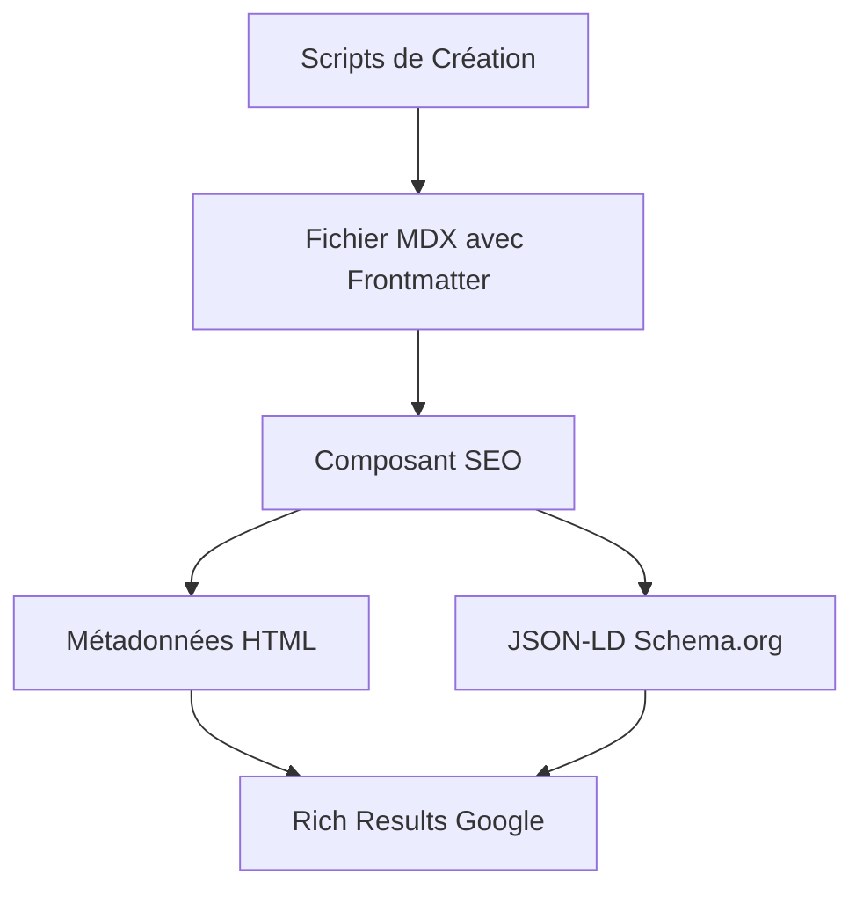

# 🔗 Intégration Scripts ↔ Composant SEO

## 🎯 Vue d'ensemble de l'Architecture



## ✅ **Compatibilité et Indépendance**

### 🔄 **Scripts SANS Composant SEO**
```yaml
# Scripts génèrent ce frontmatter :
---
title: "Mon Article"
schemaTypes: ["TechArticle", "BlogPosting"]
proficiencyLevel: "Intermediate"
programmingLanguage: ["JavaScript"]
timeRequired: "PT30M"
---
```

**Résultat :** Article MDX fonctionnel avec métadonnées structurées, mais pas de SEO automatique.

### 🚀 **Scripts AVEC Composant SEO**
Le même frontmatter est automatiquement transformé en :

```html
<!-- Métadonnées HTML -->
<meta property="og:type" content="article" />
<meta name="article:section" content="Technology" />

<!-- JSON-LD Schema.org -->
<script type="application/ld+json">
{
  "@context": "https://schema.org",
  "@type": "TechArticle",
  "proficiencyLevel": "Intermediate",
  "programmingLanguage": "JavaScript",
  "timeRequired": "PT30M"
}
</script>
```

## 🎯 **Champs Supportés par l'Intégration**

### ✅ **Champs Scripts → SEO (Automatiques)**

| Champ Scripts | Utilisation SEO | Type Schema |
|---------------|-----------------|-------------|
| `schemaTypes` | Type de schéma principal | Tous |
| `proficiencyLevel` | Niveau technique | TechArticle |
| `programmingLanguage` | Langage de programmation | TechArticle |
| `timeRequired` | Temps de lecture/exécution | TechArticle, HowTo |
| `difficulty` | Niveau de difficulté | HowTo |
| `tool` | Outils nécessaires | HowTo |
| `supply` | Matériel requis | HowTo |
| `yield` | Résultat attendu | HowTo |
| `faq` | Questions/Réponses | FAQPage |
| `numberOfItems` | Nombre d'éléments | CollectionPage |

### 🔧 **Détection Automatique par le Composant SEO**

```javascript
// Le composant SEO lit automatiquement :
const schemaTypes = frontMatter?.schemaTypes;
const proficiencyLevel = frontMatter?.proficiencyLevel;
const programmingLanguage = frontMatter?.programmingLanguage;

// Et génère le JSON-LD approprié
```

## 🚫 **Utilisation SANS le Composant SEO**

### Cas d'usage possibles :
1. **Site Docusaurus simple** sans besoins SEO avancés
2. **Génération de contenu** pour migration vers autre CMS
3. **Prototypage rapide** sans optimisation SEO
4. **Tests et développement** avant intégration SEO

### ⚠️ **Limitations sans composant SEO :**
- ❌ Pas de métadonnées HTML automatiques
- ❌ Pas de JSON-LD Schema.org
- ❌ Pas de Rich Results Google
- ❌ Pas de validation SEO automatique

## 🎨 **Alternative : SEO Manuel**

Si vous n'utilisez pas le composant SEO, vous pouvez :

```mdx
---
title: "Mon Article"
description: "Description SEO"
# Frontmatter généré par les scripts
schemaTypes: ["TechArticle"]
proficiencyLevel: "Intermediate"
---

export const seoData = {
  title: "Mon Article", 
  description: "Description SEO"
};

<Head>
  <meta property="og:title" content={seoData.title} />
  <meta property="og:description" content={seoData.description} />
</Head>

# Mon Article

Contenu ici...
```

## 🏗️ **Installation Optionnelle du Composant SEO**

### Étapes pour bénéficier de l'intégration complète :

1. **Copier le composant** :
```bash
# Créer la structure
mkdir -p src/components/Seo
mkdir -p src/components/SeoDebugPanel
```

2. **Intégrer dans Layout** :
```javascript
// src/theme/Layout/index.js
import Seo from '@site/src/components/Seo';

export default function Layout({children, ...props}) {
  return (
    <>
      <Seo />
      <OriginalLayout {...props}>
        {children}
      </OriginalLayout>
    </>
  );
}
```

3. **Tester l'intégration** :
```bash
# Créer un article avec les scripts
node scripts/quick-article.js TechArticle "Test Intégration"

# Vérifier que les métadonnées SEO apparaissent
npm run dev
# → Inspecter le code source de la page
```

## 📊 **Matrice de Compatibilité**

| Fonctionnalité | Scripts Seuls | + Composant SEO |
|----------------|---------------|-----------------|
| Création d'articles | ✅ | ✅ |
| Frontmatter structuré | ✅ | ✅ |
| Contenu de base | ✅ | ✅ |
| Métadonnées HTML | ❌ | ✅ |
| JSON-LD Schema.org | ❌ | ✅ |
| Rich Results Google | ❌ | ✅ |
| Validation SEO | ❌ | ✅ |
| Debug Panel | ❌ | ✅ |

## 🎯 **Recommandations**

### ✅ **AVEC Composant SEO (Recommandé)**
- Blog professionnel
- SEO important
- Rich Results souhaités
- Validation automatique

### 🔧 **SANS Composant SEO**
- Site de développement/test
- SEO non prioritaire  
- Migration temporaire
- Contraintes techniques

## 📚 **Liens de Documentation**

- [Guide d'installation du Composant SEO](../blog/2025/08/29/seotools/index.mdx)
- [Documentation complète Composant SEO](../src/components/Seo/README.md)
- [Scripts de création](../scripts/README.md)

---

**Conclusion :** Les scripts sont **autonomes** mais **optimisés** pour le composant SEO. L'intégration offre une expérience SEO complète et automatisée.
