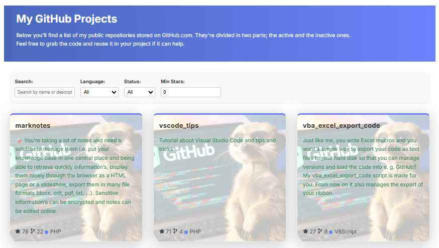

# 📦 GithubProjects Component

A React component for displaying and filtering GitHub repositories for a given user. Built for [Docusaurus](https://docusaurus.io/) sites, this component fetches public repositories from the GitHub API and presents them in a visually rich, interactive grid.

## 🚀 Features

- 🔍 **Search** by repository name or description
- 🎛️ **Filter** by language, archived status, and minimum stars
- 🎨 **Dynamic styling** based on language color
- ⚡ **Fade-in animation** for smooth visual entry
- 🧠 **Local caching** to reduce API calls
- 📊 **Sorts** by popularity (stars) or alphabetically

## Example

Out-of-the-box, here is how the component will looks like:



## 📦 Installation

Make sure your project uses React and Docusaurus 3.x. Then place the component in your desired location:

```bash
src/components/GithubProjects/GithubProjects.js
src/components/GithubProjects/styles.module.css
```

## 🧪 Usage

```jsx
import GithubProjects from "@site/src/components/GithubProjects";

<GithubProjects username="your-github-username" />;
```

## 🧾 Props

| Prop       | Type   | Required | Default | Description                           |
| ---------- | ------ | -------- | ------- | ------------------------------------- |
| `username` | string | ✅       | —       | GitHub username to fetch repositories |

## 🧠 Filtering Options

- Search: Type keywords to match repo name or description
- Language: Dynamically generated from fetched data
- Archived: Show active, archived, or all repos
- Min Stars: Filter by minimum star count

## 🎨 Styling

The component uses `styles.module.css` for scoped styling. You can customize:

- Background image
- Card hover effects
- Fade-in animation
- Filter panel layout

## 🛠️ Development Notes

- Uses GitHub REST API: `https://api.github.com/users/{username}/repos`
- Caches repo data in localStorage for 24 hours
- Handles pagination (up to 100 repos per page)
- Responsive layout using Docusaurus grid classes

## 📄 License

MIT — free to use, modify, and share.

## 💬 IA generated

This code has been generated by Christophe Avonture using IA.
