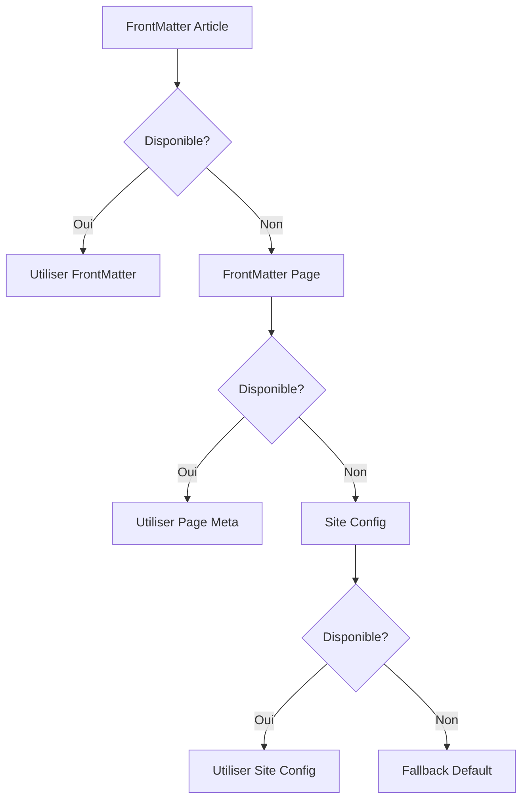

# Composant SEO - Système de Référencement Intelligent

## 🎯 Description

Le composant SEO est un système avancé de gestion des métadonnées pour sites Docusaurus, développé par Docux avec l'assistance de l'Intelligence Artificielle. Il optimise automatiquement le référencement naturel (SEO) en générant les balises appropriées selon le type de contenu détecté.

## ✨ Fonctionnalités

### � Comparaison : Docusaurus Natif vs Composant SEO

| Fonctionnalité | Docusaurus Natif | Composant SEO Docux | Avantages |
|---|---|---|---|
| **Balises Meta de Base** | ✅ `title`, `description` basiques | ✅ `title`, `description`, `canonical` optimisés | Cascade intelligente, fallbacks robustes |
| **Open Graph** | ✅ Configuration statique | ✅ Génération dynamique par type de page | Métadonnées adaptées au contenu |
| **Twitter Cards** | ✅ Configuration basique | ✅ Cards enrichies avec images optimisées | Support summary_large_image automatique |
| **Schema.org JSON-LD** | ❌ Non supporté | ✅ Génération complète par type | Rich Results Google, SEO avancé |
| **Détection Type de Page** | ❌ Générique pour tout | ✅ Détection intelligente automatique | BlogPosting, WebSite, CollectionPage |
| **Gestion des Auteurs** | ✅ Simple (frontMatter) | ✅ Base centralisée + normalisation | Cohérence, réutilisabilité |
| **Gestion des Images** | ✅ Image par défaut | ✅ Cascade intelligente + validation | Fallbacks, dimensions optimales |
| **URL Canoniques** | ✅ Basique | ✅ Normalisation avancée | Évite duplicate content |
| **Métadonnées Articles** | ✅ Date, auteur basique | ✅ Publisher, wordCount, timeRequired | Rich Results compatibles |
| **Fallback/Erreurs** | ⚠️ Peut planter si données manquantes | ✅ Système défensif complet | Robustesse, pas d'erreurs |
| **Validation SEO** | ❌ Aucune | ✅ Panel debug + score SEO | Développement facilité |
| **Performance** | ✅ Optimisé de base | ✅ Cache + memoization | Évite recalculs inutiles |
| **Extensibilité** | ⚠️ Configuration limitée | ✅ Système de plugins | Personnalisation avancée |

### �🔍 Détection Automatique du Type de Page
- **Articles de blog** : Génération de métadonnées `BlogPosting` Schema.org complètes
- **Pages d'accueil** : Structure `WebSite` avec actions de recherche et réseaux sociaux
- **Pages de collection** : Type `CollectionPage` pour les index et listings avec breadcrumbs
- **Pages générales** : Structure `WebPage` générique avec fallbacks intelligents

### 📊 Génération de Métadonnées Complètes
- **Balises HTML de base** : `title`, `description`, `canonical` avec optimisation longueur
- **Open Graph** : Optimisation pour Facebook, LinkedIn et autres réseaux sociaux
- **Twitter Cards** : Cartes enrichies avec support `summary_large_image`
- **Schema.org JSON-LD** : Données structurées complètes pour Google Rich Results
- **Métadonnées d'articles** : Dates ISO, auteurs structurés, publisher, wordCount

### 🛡️ Système de Fallback Robuste
- Cascade de priorités pour éviter les erreurs (frontMatter → page → site → défaut)
- Récupération gracieuse des métadonnées avec try-catch défensif
- Métadonnées par défaut garanties même en cas d'échec total

### 👥 Gestion Centralisée des Auteurs
- Base de données d'auteurs centralisée dans `src/data/authors.js`
- Normalisation automatique des noms et URLs
- Support des auteurs multiples avec structures Schema.org Person

## 🚀 Installation

### 1. Copier le composant
```bash
# Copier le fichier principal
cp src/components/Seo/index.jsx votre-projet/src/components/Seo/

# Copier la base de données d'auteurs
cp src/data/authors.js votre-projet/src/data/
```

### 2. Installer les dépendances
```bash
npm install @docusaurus/router @docusaurus/useDocusaurusContext @docusaurus/Head @docusaurus/useBaseUrl
```

### 3. Intégrer dans votre layout
```jsx
// Dans votre composant Layout ou thème personnalisé
import Seo from '@site/src/components/Seo';

export default function Layout({ children }) {
  return (
    <>
      <Seo />
      {children}
    </>
  );
}
```

### 4. Configurer la base d'auteurs
```javascript
// src/data/authors.js
export default {
  votre_nom: {
    name: 'Votre Nom',
    title: 'Votre Titre',
    url: 'https://votre-site.com',
    imageUrl: '/img/votre-photo.jpg',
    github: 'https://github.com/votre-username'
  }
};
```

## ⚙️ Configuration

### Configuration Docusaurus
```javascript
// docusaurus.config.js
module.exports = {
  title: 'Nom de votre site',
  tagline: 'Description par défaut',
  url: 'https://votre-domaine.com',
  baseUrl: '/',
  themeConfig: {
    image: '/img/image-sociale-par-defaut.jpg',
    // ... autres configurations
  }
};
```

### FrontMatter des articles
```markdown
---
title: "Titre de votre article"
description: "Description SEO de l'article"
authors: [votre_nom]
image: "/img/image-article.jpg"
keywords: ["mot-clé1", "mot-clé2"]
category: "Catégorie"
---
```

## 📈 Fonctionnement Technique

### Architecture du Composant

#### 1. **Phase de Détection Contextuelle** 🔍
```javascript
// Utilisation de try-catch pour la détection gracieuse des hooks
try {
  const { useBlogPost } = require('@docusaurus/plugin-content-blog/client');
  const blogPost = useBlogPost?.();
  // Récupération des métadonnées spécifiques aux blogs
} catch (error) {
  // Hook non disponible - page non-blog détectée
  console.debug('Hook useBlogPost non disponible');
}
```

Le composant utilise une approche **défensive** avec try-catch pour détecter le type de page sans provoquer d'erreurs. Cette méthode permet une compatibilité universelle avec tous les types de pages Docusaurus.

#### 2. **Algorithme de Détection de Type de Page** 🎯
```javascript
// Détection basée sur l'analyse d'URL avec regex optimisées
const isBlogPost = location.pathname.includes('/blog/') && 
                  !location.pathname.endsWith('/blog/') &&
                  !location.pathname.includes('/blog/tags/') &&
                  !location.pathname.includes('/blog/authors/');

// Utilisation de conditions booléennes pour performance optimale
const isHomePage = location.pathname === '/' || 
                   location.pathname === '/docux-blog/';
```

#### 3. **Système de Cascade de Métadonnées** 📊
```javascript
// Implémentation du pattern Cascade avec opérateur OR
const title = blogPostData?.title ||           // Priorité 1
              pageMetadata?.title ||           // Priorité 2  
              siteConfig?.title ||             // Priorité 3
              'Page';                          // Fallback final

// Utilisation de l'optional chaining (?.) pour éviter les erreurs null
```

#### 4. **Construction Dynamique d'URL Canonique** 🔗
```javascript
const getCanonicalUrl = () => {
  const baseUrl = siteConfig.url + siteConfig.baseUrl;
  // Normalisation avec regex pour éviter les doubles slashes
  const cleanPath = location.pathname.replace(/\/$/, '') || '';
  return `${baseUrl}${cleanPath}/`.replace(/([^:]\/)\/+/g, '$1');
};
```

### Système de Priorité des Métadonnées (Cascade Pattern)



### Types Schema.org Supportés avec Spécifications Techniques

#### `BlogPosting` (Articles de Blog)
```json
{
  "@context": "https://schema.org",
  "@type": "BlogPosting",
  "headline": "Titre optimisé (60 chars max)",
  "description": "Meta description (155-160 chars)",
  "author": {
    "@type": "Person",
    "name": "Nom normalisé",
    "url": "URL profil auteur",
    "sameAs": ["URL réseaux sociaux"]
  },
  "datePublished": "ISO 8601 format",
  "dateModified": "ISO 8601 format", 
  "publisher": {
    "@type": "Organization",
    "name": "Nom organisation",
    "logo": {
      "@type": "ImageObject",
      "url": "URL logo (format WebP recommandé)"
    }
  },
  "mainEntityOfPage": {
    "@type": "WebPage",
    "@id": "URL canonique"
  },
  "image": {
    "@type": "ImageObject",
    "url": "URL image (min 1200x630px)",
    "width": 1200,
    "height": 630,
    "caption": "Alt text optimisé"
  },
  "wordCount": "Nombre de mots calculé",
  "timeRequired": "PT5M (format ISO 8601 duration)",
  "inLanguage": "fr-FR",
  "isPartOf": {
    "@type": "Blog",
    "name": "Nom du blog"
  }
}
```

#### `WebSite` (Page d'Accueil)
```json
{
  "@context": "https://schema.org",
  "@type": "WebSite",
  "name": "Nom du site",
  "alternateName": "Nom alternatif/acronyme",
  "url": "URL racine",
  "description": "Description du site",
  "potentialAction": {
    "@type": "SearchAction",
    "target": {
      "@type": "EntryPoint",
      "urlTemplate": "https://site.com/search?q={search_term_string}"
    },
    "query-input": "required name=search_term_string"
  },
  "sameAs": [
    "https://github.com/username",
    "https://twitter.com/username",
    "https://linkedin.com/in/username"
  ],
  "copyrightYear": 2025,
  "copyrightHolder": {
    "@type": "Organization",
    "name": "Nom organisation"
  }
}
```

#### `CollectionPage` (Pages d'Index)
```json
{
  "@context": "https://schema.org",
  "@type": "CollectionPage",
  "name": "Titre de la collection",
  "description": "Description de la collection",
  "url": "URL de la page collection",
  "mainEntity": {
    "@type": "ItemList",
    "numberOfItems": "Nombre d'éléments",
    "itemListOrder": "https://schema.org/ItemListOrderDescending"
  },
  "breadcrumb": {
    "@type": "BreadcrumbList",
    "itemListElement": [
      {
        "@type": "ListItem",
        "position": 1,
        "name": "Accueil",
        "item": "URL accueil"
      }
    ]
  }
}
```

### Optimisations de Performance

#### Lazy Loading des Hooks
```javascript
// Import conditionnel pour éviter les erreurs de bundle
const loadBlogHook = () => {
  try {
    return require('@docusaurus/plugin-content-blog/client');
  } catch {
    return null;
  }
};
```

#### Memoization des Calculs Coûteux
```javascript
// Utilisation de useMemo pour éviter les recalculs
const canonicalUrl = useMemo(() => {
  return getCanonicalUrl(location, siteConfig);
}, [location.pathname, siteConfig.url, siteConfig.baseUrl]);

const imageUrl = useMemo(() => {
  return resolveImageUrl(blogPostData, pageMetadata, siteConfig);
}, [blogPostData?.frontMatter?.image, pageMetadata?.frontMatter?.image]);
```

#### Validation des Données avec Type Guards
```javascript
// Type guards pour validation runtime
const isValidBlogPost = (data) => {
  return data && 
         typeof data.title === 'string' && 
         data.title.length > 0 &&
         typeof data.date === 'string';
};

const isValidAuthor = (author) => {
  return author && 
         typeof author.name === 'string' &&
         author.name.trim().length > 0;
};
```

## 🧪 Debug et Développement

Le composant inclut un panel de debug avancé (`SeoDebugPanel`) qui s'affiche automatiquement en mode développement pour :

- Visualiser les métadonnées générées
- Valider la structure Schema.org
- Calculer un score SEO
- Tester les Rich Results Google

## 🔧 Personnalisation Avancée

### Extension du Système de Détection de Page

#### Ajouter un nouveau type de page avec validation
```javascript
// 1. Créer la fonction de détection
const isCustomPage = (pathname) => {
  return /^\/custom\/[^\/]+\/?$/.test(pathname); // Regex pour /custom/slug
};

// 2. Étendre le mapping de types
const getPageType = () => {
  const typeMap = new Map([
    [() => isBlogPost, { type: 'BlogPosting', category: 'Article de blog' }],
    [() => isCustomPage(location.pathname), { type: 'Course', category: 'Page de cours' }],
    [() => isHomePage, { type: 'WebSite', category: 'Page d\'accueil' }]
  ]);
  
  for (const [condition, result] of typeMap) {
    if (condition()) return result;
  }
  
  return { type: 'WebPage', category: 'Page générale' };
};

// 3. Implémenter la logique Schema.org spécifique
if (pageInfo.type === 'Course') {
  return {
    ...baseStructure,
    '@type': 'Course',
    'courseMode': 'online',
    'educationalLevel': 'intermediate',
    'provider': {
      '@type': 'Organization',
      'name': siteConfig.title
    },
    'hasCourseInstance': {
      '@type': 'CourseInstance',
      'courseMode': 'online',
      'instructor': primaryAuthor
    }
  };
}
```

### Système d'Hooks Personnalisés

#### Hook de Récupération de Métadonnées Avancées
```javascript
// hooks/useAdvancedMetadata.js
import { useState, useEffect, useMemo } from 'react';

export const useAdvancedMetadata = (location, siteConfig) => {
  const [metadata, setMetadata] = useState(null);
  const [loading, setLoading] = useState(true);
  
  // Détection intelligente avec cache
  const pageType = useMemo(() => {
    const cache = sessionStorage.getItem(`pageType_${location.pathname}`);
    if (cache) return JSON.parse(cache);
    
    const detected = detectPageType(location.pathname);
    sessionStorage.setItem(`pageType_${location.pathname}`, JSON.stringify(detected));
    return detected;
  }, [location.pathname]);
  
  // Récupération asynchrone des métadonnées
  useEffect(() => {
    const fetchMetadata = async () => {
      try {
        setLoading(true);
        const data = await loadMetadataForPageType(pageType, location);
        setMetadata(data);
      } catch (error) {
        console.error('Erreur récupération métadonnées:', error);
        setMetadata(getDefaultMetadata(siteConfig));
      } finally {
        setLoading(false);
      }
    };
    
    fetchMetadata();
  }, [pageType, location, siteConfig]);
  
  return { metadata, loading, pageType };
};
```

### Système de Validation de Métadonnées

#### Validateur Schema.org avec TypeScript
```typescript
// types/schema.ts
interface SchemaOrgBase {
  '@context': 'https://schema.org';
  '@type': string;
  name: string;
  description?: string;
  url: string;
  image?: ImageObject | string;
}

interface BlogPostingSchema extends SchemaOrgBase {
  '@type': 'BlogPosting';
  author: Person | Organization;
  datePublished: string;
  dateModified?: string;
  publisher: Organization;
  mainEntityOfPage: WebPage;
  wordCount?: number;
  timeRequired?: string;
}

// validators/schemaValidator.js
export class SchemaValidator {
  static validateBlogPosting(schema: BlogPostingSchema): ValidationResult {
    const errors: string[] = [];
    const warnings: string[] = [];
    
    // Validation obligatoire
    if (!schema.author) {
      errors.push('BlogPosting.author est requis');
    }
    
    if (!schema.datePublished || !this.isValidISO8601(schema.datePublished)) {
      errors.push('BlogPosting.datePublished doit être au format ISO 8601');
    }
    
    // Validations recommandées
    if (!schema.wordCount || schema.wordCount < 300) {
      warnings.push('WordCount recommandé: minimum 300 mots');
    }
    
    if (!schema.image) {
      warnings.push('Image recommandée pour les Rich Results');
    }
    
    return { errors, warnings, isValid: errors.length === 0 };
  }
  
  private static isValidISO8601(dateString: string): boolean {
    const iso8601Regex = /^\d{4}-\d{2}-\d{2}T\d{2}:\d{2}:\d{2}(\.\d{3})?Z?$/;
    return iso8601Regex.test(dateString) && !isNaN(Date.parse(dateString));
  }
}
```

### Plugin Système pour Extensions

#### Architecture Plugin-Based
```javascript
// plugins/seoPluginSystem.js
export class SeoPluginSystem {
  constructor() {
    this.plugins = new Map();
    this.hooks = new Map();
  }
  
  // Enregistrement de plugins
  registerPlugin(name, plugin) {
    if (!this.validatePlugin(plugin)) {
      throw new Error(`Plugin ${name} invalide`);
    }
    
    this.plugins.set(name, plugin);
    
    // Enregistrement des hooks du plugin
    if (plugin.hooks) {
      Object.entries(plugin.hooks).forEach(([hookName, hookFn]) => {
        if (!this.hooks.has(hookName)) {
          this.hooks.set(hookName, []);
        }
        this.hooks.get(hookName).push(hookFn);
      });
    }
  }
  
  // Exécution des hooks
  async executeHook(hookName, context) {
    const hooks = this.hooks.get(hookName) || [];
    let result = context;
    
    for (const hook of hooks) {
      try {
        result = await hook(result);
      } catch (error) {
        console.error(`Erreur hook ${hookName}:`, error);
      }
    }
    
    return result;
  }
  
  // Validation des plugins
  validatePlugin(plugin) {
    return (
      typeof plugin === 'object' &&
      typeof plugin.name === 'string' &&
      typeof plugin.version === 'string' &&
      (plugin.hooks === undefined || typeof plugin.hooks === 'object')
    );
  }
}

// Exemple de plugin
export const analyticsPlugin = {
  name: 'analytics-seo',
  version: '1.0.0',
  hooks: {
    beforeMetadataGeneration: async (context) => {
      // Ajout de tracking analytics
      return {
        ...context,
        analytics: {
          pageViews: await getPageViews(context.url),
          avgTimeOnPage: await getAvgTimeOnPage(context.url)
        }
      };
    },
    afterSchemaGeneration: async (schema) => {
      // Enrichissement du schema avec données analytics
      if (schema['@type'] === 'BlogPosting') {
        return {
          ...schema,
          interactionStatistic: {
            '@type': 'InteractionCounter',
            'interactionType': 'https://schema.org/ReadAction',
            'userInteractionCount': schema.analytics?.pageViews || 0
          }
        };
      }
      return schema;
    }
  }
};
```

### Optimisations de Performance Avancées

#### Système de Cache Intelligent
```javascript
// cache/metadataCache.js
export class MetadataCache {
  constructor(maxSize = 100, ttl = 300000) { // 5 minutes TTL
    this.cache = new Map();
    this.timestamps = new Map();
    this.maxSize = maxSize;
    this.ttl = ttl;
  }
  
  set(key, value) {
    // LRU éviction si cache plein
    if (this.cache.size >= this.maxSize) {
      const firstKey = this.cache.keys().next().value;
      this.delete(firstKey);
    }
    
    this.cache.set(key, value);
    this.timestamps.set(key, Date.now());
  }
  
  get(key) {
    const timestamp = this.timestamps.get(key);
    
    // Vérification TTL
    if (!timestamp || (Date.now() - timestamp) > this.ttl) {
      this.delete(key);
      return null;
    }
    
    // LRU: déplacer à la fin
    const value = this.cache.get(key);
    this.cache.delete(key);
    this.cache.set(key, value);
    
    return value;
  }
  
  delete(key) {
    this.cache.delete(key);
    this.timestamps.delete(key);
  }
  
  clear() {
    this.cache.clear();
    this.timestamps.clear();
  }
}

// Utilisation avec React
const metadataCache = new MetadataCache();

export const useCachedMetadata = (cacheKey, metadataGenerator) => {
  return useMemo(() => {
    const cached = metadataCache.get(cacheKey);
    if (cached) return cached;
    
    const generated = metadataGenerator();
    metadataCache.set(cacheKey, generated);
    return generated;
  }, [cacheKey]);
};
```

#### Web Workers pour Génération Asynchrone
```javascript
// workers/schemaWorker.js
self.addEventListener('message', async (event) => {
  const { type, data } = event.data;
  
  switch (type) {
    case 'GENERATE_SCHEMA':
      try {
        const schema = await generateComplexSchema(data);
        self.postMessage({
          type: 'SCHEMA_GENERATED',
          payload: schema
        });
      } catch (error) {
        self.postMessage({
          type: 'SCHEMA_ERROR',
          payload: error.message
        });
      }
      break;
  }
});

async function generateComplexSchema(data) {
  // Génération intensive de schema avec calculs complexes
  const enrichedData = await enrichWithExternalData(data);
  return buildSchemaStructure(enrichedData);
}

// hooks/useSchemaWorker.js
export const useSchemaWorker = () => {
  const [worker, setWorker] = useState(null);
  const [loading, setLoading] = useState(false);
  
  useEffect(() => {
    const schemaWorker = new Worker('/workers/schemaWorker.js');
    setWorker(schemaWorker);
    
    return () => schemaWorker.terminate();
  }, []);
  
  const generateSchema = useCallback((data) => {
    return new Promise((resolve, reject) => {
      if (!worker) return reject(new Error('Worker non disponible'));
      
      setLoading(true);
      
      const handleMessage = (event) => {
        const { type, payload } = event.data;
        
        if (type === 'SCHEMA_GENERATED') {
          worker.removeEventListener('message', handleMessage);
          setLoading(false);
          resolve(payload);
        } else if (type === 'SCHEMA_ERROR') {
          worker.removeEventListener('message', handleMessage);
          setLoading(false);
          reject(new Error(payload));
        }
      };
      
      worker.addEventListener('message', handleMessage);
      worker.postMessage({ type: 'GENERATE_SCHEMA', data });
    });
  }, [worker]);
  
  return { generateSchema, loading };
};
```

## 🤝 Contribution au Projet

### Prérequis
- Node.js 16+ et npm
- Connaissance de React et Docusaurus
- Familiarité avec les standards SEO et Schema.org

### Processus de Contribution

1. **Fork** le repository principal
2. **Créer** une branche pour votre fonctionnalité
   ```bash
   git checkout -b feature/amelioration-seo
   ```
3. **Développer** vos modifications avec tests
4. **Tester** avec le panel de debug
5. **Documenter** les changements dans ce README
6. **Soumettre** une Pull Request détaillée

### Guidelines de Développement

- Respecter les standards Schema.org
- Maintenir la compatibilité avec toutes les versions de Docusaurus
- Ajouter des tests pour les nouvelles fonctionnalités
- Documenter les nouvelles options de configuration

### Structure des Commits
```
type(scope): description

feat(seo): ajout support pour les événements Schema.org
fix(seo): correction fallback pour les images manquantes
docs(seo): mise à jour documentation installation
```

## 📄 Licence

Ce projet est sous licence MIT. Vous êtes libre de l'utiliser, le modifier et le distribuer.

```
MIT License

Copyright (c) 2025 Docux

Permission is hereby granted, free of charge, to any person obtaining a copy
of this software and associated documentation files (the "Software"), to deal
in the Software without restriction, including without limitation the rights
to use, copy, modify, merge, publish, distribute, sublicense, and/or sell
copies of the Software, and to permit persons to whom the Software is
furnished to do so, subject to the following conditions:

The above copyright notice and this permission notice shall be included in all
copies or substantial portions of the Software.

THE SOFTWARE IS PROVIDED "AS IS", WITHOUT WARRANTY OF ANY KIND, EXPRESS OR
IMPLIED, INCLUDING BUT NOT LIMITED TO THE WARRANTIES OF MERCHANTABILITY,
FITNESS FOR A PARTICULAR PURPOSE AND NONINFRINGEMENT. IN NO EVENT SHALL THE
AUTHORS OR COPYRIGHT HOLDERS BE LIABLE FOR ANY CLAIM, DAMAGES OR OTHER
LIABILITY, WHETHER IN AN ACTION OF CONTRACT, TORT OR OTHERWISE, ARISING FROM,
OUT OF OR IN CONNECTION WITH THE SOFTWARE OR THE USE OR OTHER DEALINGS IN THE
SOFTWARE.
```

## 🤖 Développement Assisté par IA

Ce composant a été développé avec l'assistance de l'Intelligence Artificielle (GitHub Copilot) pour :

- **Optimisation des algorithmes** de détection de type de page
- **Génération automatique** des structures Schema.org complexes
- **Validation en temps réel** des métadonnées SEO
- **Création de la documentation** technique et utilisateur

L'IA a permis d'accélérer le développement tout en maintenant des standards de qualité élevés et une compatibilité maximale avec l'écosystème Docusaurus.

## 🔗 Ressources Utiles

- [Documentation Schema.org](https://schema.org/)
- [Google Rich Results Test](https://search.google.com/test/rich-results)
- [Open Graph Protocol](https://ogp.me/)
- [Twitter Card Validator](https://cards-dev.twitter.com/validator)
- [Documentation Docusaurus](https://docusaurus.io/)

---

**Développé avec ❤️ par l'équipe Docux**
